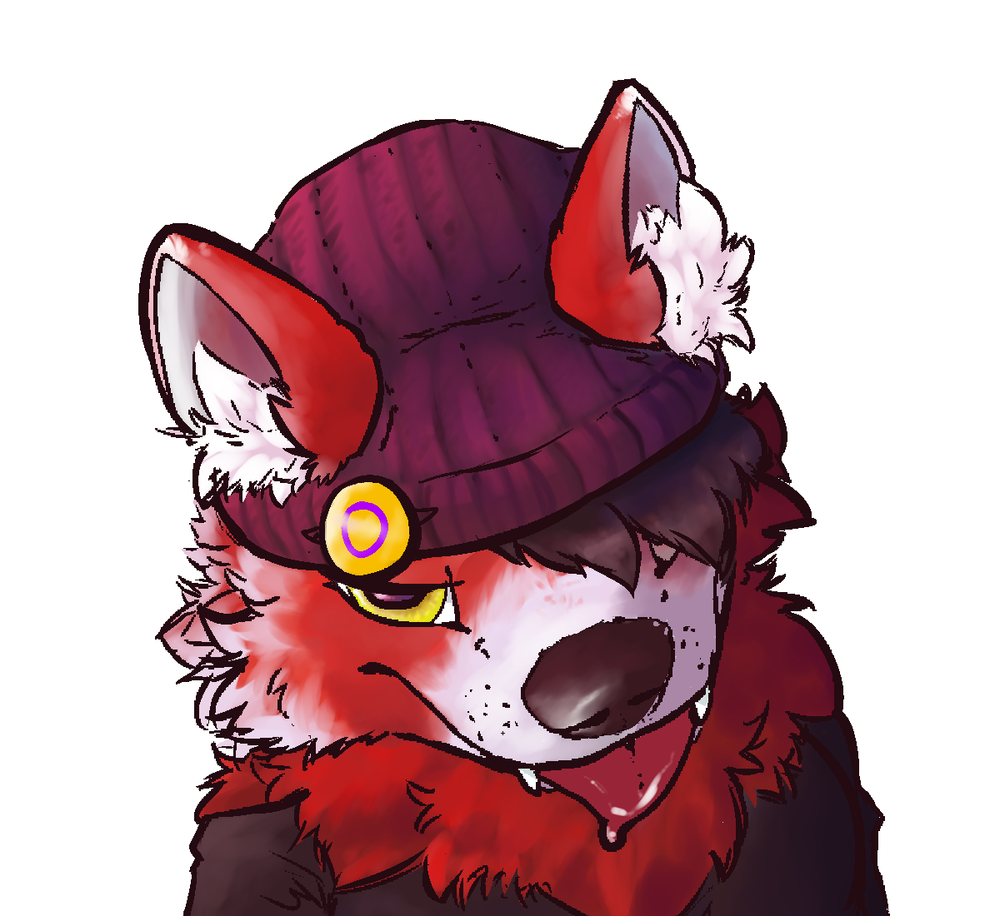

<!--
- 🔭 I’m currently working on ...
- 🌱 I’m currently learning ...
- 👯 I’m looking to collaborate on ...
- 🤔 I’m looking for help with ...
- 💬 Ask me about ...
- 📫 How to reach me: ...
- 😄 Pronouns: ...
- ⚡ Fun fact: ...
-->

  

<h1 align="center">Hi, welcome to our Github! 👋</h1>

	We're Nebula; a plural a Biology major who tinkers with code in their freetime. 
	 
	You can reach us via: 
 	Discord - lyricalpaws 
 	<a href="https://t.me/lyricalpaws">Telegram</a>

	
	
	

	

